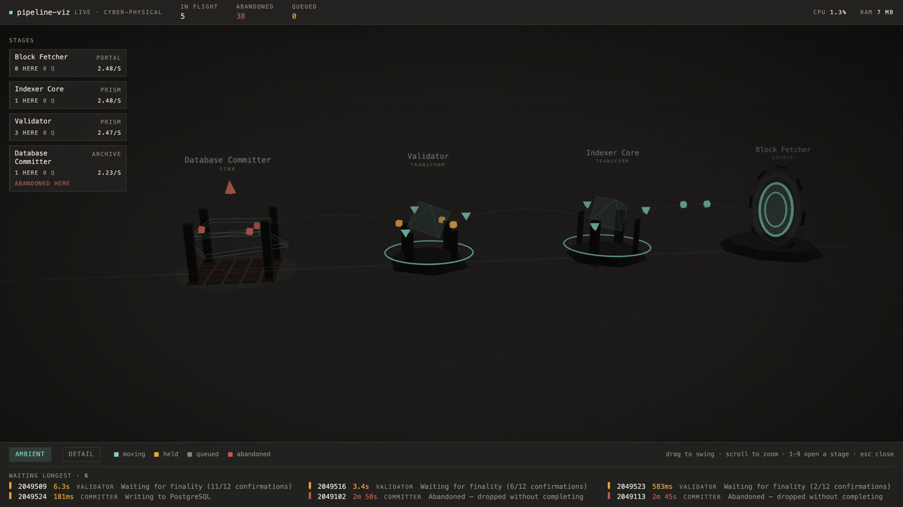
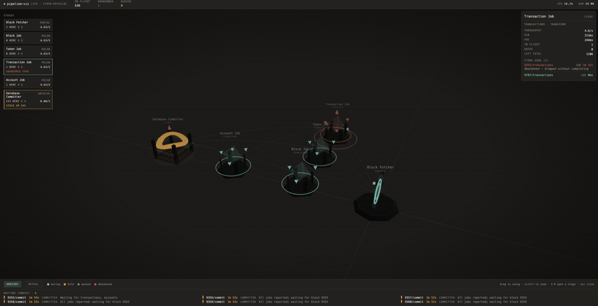
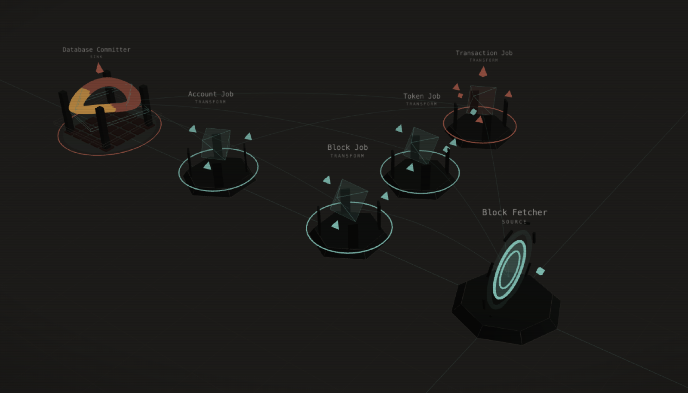

# pipeline-viz

Live item-level visibility for Rust data pipelines.

`tracing` shows spans. `tokio-console` shows tasks. Prometheus shows counters. None of them answer the question that actually stalls a debugging session:

> Where is block 2049102 right now, and why has it not moved in forty seconds?

`pipeline-viz` answers exactly that. Declare your stages, wrap each work item in a guard, and give a reason whenever an item is parked. Every item is then visible by name, at a named stage, with the reason it is sitting there — and an item that is dropped on the floor shows up as **abandoned** instead of silently vanishing.



The dashboard is compiled into your binary. There is no static directory to deploy and no Node.js on the machine that runs it.

## Quickstart

```toml
[dependencies]
pipeline-viz = { version = "0.1", features = ["viz"] }
```

```rust
use pipeline_viz::{NodeKind, PipelineTracker};

#[tokio::main]
async fn main() -> Result<(), Box<dyn std::error::Error>> {
    let tracker = PipelineTracker::builder()
        .bind_port(9999)
        .start_background()?;

    tracker.register_node_named("committer", "Database Committer", NodeKind::Sink, ["indexer"]);

    let mut job = tracker
        .job("committer")
        .id(2_049_102)
        .job_type("Block")
        .meta("tx_count", 142)
        .start();

    job.hold("Waiting for finality (2/12 confirmations)");
    // ... wait for confirmations ...

    job.update_reason("Writing to PostgreSQL");
    // ... write ...

    job.complete();
    Ok(())
}
```

Then open `http://localhost:9999`.

An item that never reaches `complete()` — because a `?` returned early, say — is marked **abandoned** rather than disappearing. That is usually the bug you were looking for.

Keep the `PipelineTracker` alive for as long as you want the dashboard: see [Lifetime](#lifetime).

## Is this the right tool?

**It fits when** work moves through named stages and you care about individual items: an indexer, an ETL job, a media transcoder, a crawler, an order pipeline, a batch importer. It fits best when the question you keep asking is "which item is stuck, and why".

**It does not fit** a request/response service (use `tracing`), a question about tasks and wakers (use `tokio-console`), aggregate rates and alerting (use Prometheus), or anything spanning multiple processes — this release watches one process only.

It is meant to sit alongside those, not replace them:

| Tool | Unit it shows | Question it answers |
| --- | --- | --- |
| `tracing` | spans | what happened during this operation |
| `tokio-console` | tasks | which task is busy or blocked |
| Prometheus | counters | how fast, how many, how often |
| `pipeline-viz` | work items | where item X is, and why it has not moved |

## Where it is safe to run

The dashboard binds `127.0.0.1` and nothing else, and it is **unauthenticated**. Anything that can reach the port can read every item id, hold reason and metadata in your pipeline. There is no option to bind a public address, because there is no safe way to offer one.

- **Local development** — open the port directly.
- **A staging box** — reach it over an SSH tunnel.
- **Production diagnosis** — same tunnel, and prefer enabling `viz` in a dev or debug profile rather than in the binary you ship. See [Off by default](#off-by-default).

```sh
ssh -N -L 9999:127.0.0.1:9999 you@your-host
# then open http://localhost:9999 on your own machine
```

## What it does not guarantee

Instrumentation never applies backpressure to the pipeline it is watching. The event channel is bounded, and when it is full the event is **dropped and counted** rather than made to wait. Under a burst that means:

- **A nonzero `dropped_events` means what you are looking at may be stale.** An enter, a completion or an abandonment can have been among the losses, so an item may show at a node it has already left, or be missing from the dashboard entirely.
- **Reconnecting does not repair it.** A new browser tab receives the collector's *current* state, which is the same state that lost those events. Nothing reconciles afterwards, and this release does not try to.
- **The only mitigations are to raise the channel capacity or to restart the tracker.**

```rust
let tracker = PipelineTracker::builder()
    .channel_capacity(65_536)   // default is 4096
    .start_background()?;

if tracker.dropped_events() > 0 {
    eprintln!("pipeline-viz dropped events; the dashboard may be stale");
}
```

The count is on the dashboard too, in the header. Treat it as a correctness signal, not a performance statistic.

## Item identity

Ids are yours. `.id(...)` takes anything that implements `Display` and stores it byte for byte; nothing is checked for uniqueness. Two items sharing an id **are one item** as far as the collector is concerned, so uniqueness across your pipeline is yours to guarantee.

Omit `.id(...)` and one is generated in the form `job_<instance>_<sequence>`, unique within the process across every clone of the tracker. That shape is **not a reserved namespace**: an explicit id may look exactly like a generated one, and if you choose to do that, the collision is yours as well.

## Abandoned item retention

An abandoned item is kept so the failure can still be seen after the fact. The default is the most recent 1000 abandoned records; once the limit is reached the oldest is evicted and reported as a removal, and an item that re-enters the pipeline leaves the queue.

```rust
PipelineTracker::builder().max_retained_abandoned(5_000)
```

This bounds the **record count only**. It does not bound the metadata bytes those records carry, so keep metadata values small, and it never evicts active or held work — a pipeline holding a million items still holds a million items. Setting it to `0` retains nothing.

## Lifetime

The dashboard belongs to the tracker, not to the process. Every `PipelineTracker` clone is an owner, including the ones held inside a `JobBuilder` and a `JobGuard`. When the last one drops, the collector, the process sampler, the HTTP server and every open WebSocket stop, and the port is released.

Shutdown is immediate and **nothing is flushed on the way out**: by the time the last handle is gone there is no handle left to observe a final patch. If you want the dashboard to outlive a function, keep a handle alive — for example with [`install`](#attribute-macros), which holds one for the life of the process.

## Attribute macros

Enable the `macros` feature and the same instrumentation becomes two annotations:

```toml
[dependencies]
pipeline-viz = { version = "0.1", features = ["viz", "macros"] }
```

```rust
use pipeline_viz::{track_job, track_node};

#[track_node(id = "committer", kind = Sink, name = "Database Committer", inputs = ["indexer"])]
#[track_job(node = "committer", id = number, job_type = "Block", meta(tx_count = 142))]
async fn commit(number: u64) -> Result<(), Error> {
    // ... write to PostgreSQL ...
    Ok(())
}
```

`track_node` registers the stage on the function's first call. `track_job` opens a guard for the body and completes it when the body returns — including an early `return` or a `?` that yielded an `Err`. A panic drops the guard instead, which is what marks the item abandoned.

Annotated functions have nowhere to receive a tracker handle, so both macros read one installed at startup:

```rust
let tracker = PipelineTracker::builder().bind_port(9999).start_background()?;
pipeline_viz::install(tracker)?;
```

They expand to exactly the runtime calls shown above and hold no state of their own, so the two surfaces cannot drift apart. With nothing installed — or with `viz` off — the generated calls do nothing.

## See it work before writing any code

`examples/tokio_pipeline.rs` is a bounded-channel Tokio pipeline: a producer and two worker stages, one item held with a reason, one item deliberately abandoned, the rest completed.

```sh
cargo run --example tokio_pipeline --features viz
# READY port=9999 mode=interactive
```

The same example can verify itself, with no browser involved. It binds an ephemeral port, connects to its own `/health` and `/ws`, and asserts over the wire that the named hold reason, the abandoned item and the completions all arrived:

```sh
cargo build --example tokio_pipeline --features viz
PIPELINE_VIZ_EXAMPLE_MODE=self-check target/debug/examples/tokio_pipeline
```

```text
READY port=59723 mode=self-check
self-check: held      block_42 reason="Waiting for finality (2/12 confirmations)"
self-check: abandoned block_45
self-check: completed 7 items
self-check: dropped_events=0
self-check: the dashboard stopped with the tracker
SELF-CHECK OK
```

To check the published crate rather than this checkout — including that a consumer needs no Node.js — run the packaging gate, which builds three consumers against the unpacked archive with `npm`, `node` and `npx` replaced by failing stubs:

```sh
bash scripts/verify-package.sh --build
```

## Watching the stream

The event stream is readable directly:

```sh
cargo run --example tokio_pipeline --features viz
websocat ws://127.0.0.1:9999/ws
```

The first frame is the complete state:

```json
{"type":"snapshot","ts_ms":1785810000000,"nodes":[...],"jobs":[...],"dropped_events":0}
```

Every frame after it is a coalesced delta covering only what changed:

```json
{"type":"patch","ts_ms":1785810000100,"nodes":[...],"jobs":[...],"removed_jobs":["block_1"],"dropped_events":0}
```

A client that stops reading is disconnected rather than sent a stream with a gap in it; reconnecting gets a fresh snapshot.

## The dashboard

It is already in your binary. Start your program and open the port you bound:

```sh
cargo run --example tokio_pipeline --features viz
open http://localhost:9999
```

The dashboard shows the pipeline graph with live per-node counters, a persistent strip of the longest-waiting items with their hold reasons, and a per-node drill-down listing what is sitting there and why. Stages turn amber when an item has been there for more than ten seconds.



Each stage takes a form from its kind — a portal for a source, a prism for a transform, an archive rack for a sink — and items are physical objects on it: teal moving, amber held, red abandoned. Queued items orbit outside the stage. The rail on the left names the stall directly, so a stuck stage is legible without opening anything.



Click a stage or press `1`-`9` to open it, `Esc` to close, `a` / `d` to switch between the ambient and detail stage modes. Drag to swing the camera, scroll to zoom.

The CPU and RAM figures in the header are **whole-process** and labelled as such — see [What it measures](#what-it-measures).

### Working on the UI

The dashboard is `templates/three-d`, built by `build.rs` and embedded with `rust-embed`; a second template, `templates/simple`, is a dense 2D alternative kept as a development target. Both run against a live producer with hot reload:

```sh
cargo run --example tokio_pipeline --features viz   # terminal one
npm install && npm run three-d:dev                  # terminal two, or simple:dev
```

Then open `http://localhost:5174` (`simple` uses 5173). Vite proxies `/ws` to the Rust server on 9999, so the browser stays on a single origin.

Building the crate with `viz` on runs the Vite build automatically. On a machine without Node.js, populate `assets/` once and set `PIPELINE_VIZ_SKIP_UI_BUILD=1`.

## Off by default

The crate does nothing unless the `viz` feature is enabled, and it is off by default. Without it, every call above compiles to an empty inlined body and none of the implementation's dependencies are built at all.

This is deliberate: nothing should be able to ship a listening port to production by accident. Enable `viz` in a dev profile, leave it off in release.

The claim is tested, not asserted — `tests/zero_overhead.rs` builds the default configuration and fails if `tokio`, `serde`, `axum`, or the UI embedder appear anywhere in the dependency tree.

## What it measures

Per node, all derived from the event stream:

- items in flight, and queue depth if your application reports one
- throughput (items leaving per second, 60-second rolling window)
- p50 and p95 time spent at the node

Per item: which node holds it, since when, and why it is held.

**Per-node CPU and RAM are deliberately absent.** Nodes are logical stages sharing one process and one thread pool, so those figures cannot be attributed to a single node honestly. Process-wide resource use is reported as process-wide.

## Troubleshooting

**Nothing appears at `localhost:9999`.** Check `tracker.is_serving()`. It is `false` when the port was already taken — the tracker still works, there is simply nothing to connect to. Bind port `0` and read `tracker.port()` to let the OS choose. A busy port never fails your program.

**The dashboard was there, then stopped.** The last `PipelineTracker` clone was dropped; see [Lifetime](#lifetime). Hold a handle for as long as you want the dashboard, or `install()` one.

**Calls compile but nothing is recorded.** The `viz` feature is off, so every call is an empty inlined body. Check the feature list on the dependency.

**`start_background()` returns `Error::NoRuntime`.** It must be called from inside a Tokio runtime — within `#[tokio::main]` or a `Runtime::block_on`.

**Items look wrong, or one is missing.** Check `dropped_events`. Nonzero means events were lost and the view may be stale; see [What it does not guarantee](#what-it-does-not-guarantee). Raise `channel_capacity`, or restart the tracker for a clean slate.

**Two different items share a row.** They share an id. Ids are not checked for uniqueness; see [Item identity](#item-identity).

**An abandoned item disappeared.** The retained-abandoned limit evicted it. Raise `max_retained_abandoned`; see [Abandoned item retention](#abandoned-item-retention).

**The build fails asking for Node.js.** You are building from a git checkout with `viz` on, which builds the dashboard from `templates/`. Consumers of the published crate never hit this — the built assets ship inside it.

## What each claim is checked by

Nothing in this README is asserted without something that fails when it stops being true.

| Claim | Checked by |
| --- | --- |
| A consumer of the published crate needs no Node.js | `scripts/verify-package.sh --build` |
| With `viz` off, none of the implementation dependencies are built | `tests/zero_overhead.rs::no_implementation_dependencies_reach_a_production_build` |
| The same code compiles with the feature on and off | `tests/zero_overhead.rs::the_public_api_still_compiles_and_does_nothing` |
| Generated ids are unique across clones and trackers | `tests/public_api.rs::generated_job_ids_are_unique_across_concurrent_clones`, `::generated_job_ids_use_distinct_tracker_prefixes` |
| Explicit ids are stored unchanged | `tests/public_api.rs::explicit_job_ids_remain_unrestricted_and_unchanged` |
| A held item is visible with its reason | `tests/public_api.rs::an_item_held_with_a_reason_is_visible_with_that_reason` |
| A dropped guard becomes abandoned | `tests/public_api.rs::an_item_dropped_on_an_early_return_shows_up_as_abandoned` |
| A full channel drops events instead of blocking | `tests/public_api.rs::a_full_channel_drops_events_instead_of_blocking_the_pipeline` |
| Abandoned records stay bounded, oldest evicted first | `src/collector/tests.rs` retention tests |
| Connecting yields a snapshot, then patches | `tests/server.rs` |
| A busy port disables the dashboard without failing | `tests/server.rs::a_busy_port_disables_the_dashboard_without_failing` |
| Dropping the last handle stops everything and frees the port | `tests/lifecycle.rs` |
| The Rust and TypeScript models agree | `tests/protocol_fixtures.rs` with `packages/protocol/src/types.test.ts` |
| Custody is visible end to end over HTTP and WebSocket | `PIPELINE_VIZ_EXAMPLE_MODE=self-check` on `examples/tokio_pipeline.rs` |
| All of the above, on Linux and macOS, at MSRV 1.75 | [`.github/workflows/ci.yml`](.github/workflows/ci.yml) |

## Design notes

- The collector is a pure function of its event stream — no clock, no I/O — so the hard logic is unit-tested without a runtime, a socket, or a browser.
- In-flight counts are derived from the item map rather than incremented alongside it, so the two cannot drift apart.
- Instrumentation uses `try_send` and counts drops. It never applies backpressure to the pipeline it is watching; the dropped-event count is surfaced rather than hidden.
- Updates are coalesced on a 100ms tick. An item crossing five nodes within one tick is reported once, at the fifth.
- Background tasks are cancelled by the tracker's own drop, so a process that starts and stops several pipelines does not accumulate listeners.

Full design: [`docs/specs/2026-08-04-pipeline-viz-mvp-design.md`](docs/specs/2026-08-04-pipeline-viz-mvp-design.md).

## Development

```sh
cargo test --features viz,macros
cargo test --no-default-features --features macros
cargo clippy --features viz,macros --all-targets -- -D warnings
cargo clippy --no-default-features --features macros --all-targets -- -D warnings
cargo fmt --all --check
npm run protocol:test && npm run protocol:typecheck
npm run simple:test && npm run simple:typecheck && npm run simple:lint && npm run simple:build
npm run three-d:test && npm run three-d:typecheck && npm run three-d:lint && npm run three-d:build
bash scripts/verify-package.sh --build
```

Both feature configurations must build and pass on their own.

## License

MIT — see [LICENSE](LICENSE).
